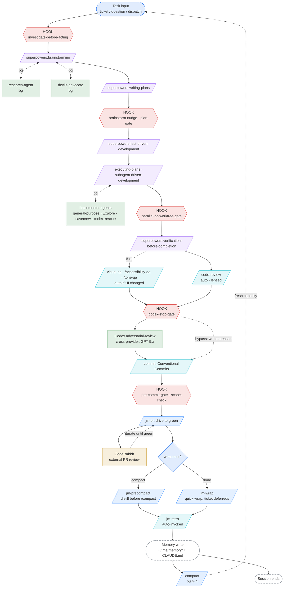

# claude-code-multimodel-workflow

A redistributable Claude Code workflow package. Routes diffs through Claude, Codex, and CodeRabbit with pre-built dispatch rules, project-aware reviewers, codified discipline patches, and the slash commands and agents that hold it all together.

> **Status:** v0.2.0. Repo renamed from `jm-workflow` for OSS clarity. See [SPEC.md](./SPEC.md) for the full specification and roadmap.

## The workflow at a glance



**Legend**

| Shape | Color | What it represents |
|---|---|---|
| rounded | blue `#1f6feb` | Intake / terminal node |
| rounded, dashed | gray `#6e7681` | Terminal / outcome node |
| parallelogram | purple `#a371f7` | `superpowers:*` skill, Claude invokes |
| parallelogram | blue `#388bfd` | `/command`, user types it |
| parallelogram | cyan `#39c5d4` | `/command`, Claude auto-invokes |
| rectangle | green `#238636` | Subagent dispatch (often background) |
| rectangle | gold `#bf8700` | External / hosted service |
| hexagon | red `#da3633` | Hook gate; must clear, retry on reject |

Side branches in dashed lines are sidecars (research, devils-advocate, implementer agents, UI QA) that rejoin the spine.

For the richer original (gutters, retry arrows, full layout), open **[docs/workflow.html](./docs/workflow.html)**. Same content with explicit stage gutters and bypass paths annotated.

## Requirements

The plugin itself only needs Claude Code. The opt-in tiers + a few hooks assume additional tooling. Install what you want to use:

| Surface | Requirement | Notes |
|---|---|---|
| Plugin (Tier 1, required) | Claude Code | Any recent CC version. |
| Claude subscription | Claude Max (subscriptionType=max) | Reflected in `~/.claude/.credentials.json`. The plugin's discipline patterns assume Max-tier limits. `ANTHROPIC_API_KEY` users may hit rate limits sooner. |
| Cross-provider review (Tier 2, opt-in) | `openai-codex` Claude Code plugin + Codex CLI auth | `claude plugin install codex@openai-codex` then `codex login`. Without it the `codex-*-gate` hooks fail closed on commits; disable those hooks in `settings.json` if you don't want Codex review. See `plugin/rules/codex-dispatch.md`. |
| MCP secret wrappers (Tier 3, opt-in) | 1Password CLI (`op`) signed in | For the `claude()` / `codex()` shell wrappers that inject MCP secrets per-cwd. v0.1.0 doesn't ship the wrappers yet; they're documented in SPEC.md for adopters to wire manually. |
| Hook helpers | `jq`, `gh`, `ripgrep` (`rg`), `git` | Most hooks shell out to these. `brew install jq gh ripgrep` on macOS. |
| Suggested skill hint | `superpowers` plugin (optional) | The `keyword-detector` hook only emits the systematic-debugging hint when this plugin is installed. |

If you skip the opt-in tiers, you'll see the workflow patterns + project-aware reviewers + commands + hooks, just without the cross-provider review layer and MCP-secret automation.

## Install

```bash
# Add the marketplace
claude plugin marketplace add thebestmensch/claude-code-multimodel-workflow

# Install the plugin
claude plugin install claude-code-multimodel-workflow
```

That's it for the plugin layer. The host-side install scripts (`install.sh`, `doctor.sh`, shell wrappers) referenced in [SPEC.md](./SPEC.md) are deferred to a later release. Set up the opt-in tiers manually for now.

> ⚠ **Heads up: codex gate friction without Codex installed.** The plugin ships fail-closed `codex-pre-commit-gate` and `codex-stop-gate` hooks. On a fresh install without the `openai-codex` plugin or `codex login`, your first commit attempt after editing code will be blocked with a message asking you to install Codex, write a bypass reason, or set `CODEX_GATE_FAIL_OPEN=1`. Two supported paths to avoid the friction:
>
> 1. **Use Codex**: `claude plugin install codex@openai-codex && codex login`. The gates then dispatch real cross-provider review.
> 2. **Disable the gates**: in your project's or user-level `settings.json`, override the `PreToolUse` and `Stop` hook arrays to omit `codex-pre-commit-gate.sh`, `codex-stop-gate.sh`, and `codex-adversarial-cap.sh`. See `plugin/rules/codex-dispatch.md` for the contract you're disabling.
>
> A future release will gate hook registration on the openai-codex plugin's presence so this isn't a separate step.

## Update

```bash
# Plugin updates (commands, agents, hooks, rules)
claude plugin update claude-code-multimodel-workflow
```

---

## Slash commands

Slash commands are the user-facing surface: what you type (`/visual-qa`), what Claude auto-invokes mid-flow (`/code-review`), and the personal wrap-up rituals at end of session.

### You invoke these

| Command | What it does | When to use |
|---|---|---|
| `/commit` | Conventional Commits message + verifies pre-commit reviews fired on the staged diff. Model can't auto-invoke this (`disable-model-invocation: true`) because it performs a real `git commit`. | After verification passes, before pushing. |
| `/jm-pr` | Drives an open PR to green: iterates with CodeRabbit and other automated reviewers until comments are resolved, then merges. | Once you push and CR starts commenting. |
| `/jm-wrap` | End-of-session cleanup. Runs retro if needed, handles trivial deferreds inline, tickets the non-trivial ones, leaves the repo clean. | At "done for the day." |
| `/jm-precompact` | Pre-compaction retro. Distills lessons and commits memory *before* `/compact` so durable rules survive summarization. | When context is hot and you want to keep going. |
| `/jm-retro` | Reflect on the session, fold durable lessons into standing instructions, surface what comes next. | Auto-invoked inside `/jm-wrap` and `/jm-precompact`; rarely typed directly. |
| `/jm-linear-groom` | Bulk-groom Linear tickets: labels, statuses, scope reduction, agent-eligibility decisions. | Weekly or when the queue gets noisy. |
| `/teams` | Orchestrate a multi-codebase feature with coordinated subagents sharing a written contract. `disable-model-invocation: true` because blast radius spans services. | Cross-service feature work. |
| `/lateral` | Five lateral-thinking personas dispatched in parallel to reframe a stuck problem; main session ranks and presents. | When you've cycled a problem 2–3 times without progress. |
| `/devils-advocate` | Manually challenge a design via the `devils-advocate` agent. | When you want adversarial review on a plan you wrote yourself. |
| `/agent-grep` | Symbol-aware ripgrep wrapper. Each hit shows the enclosing function/class so you skip the follow-up Read. | Spot-checks where you'd normally `rg` then `cat`. |

### Claude auto-invokes these mid-flow

| Command | What it does | When it fires |
|---|---|---|
| `/code-review` | Runs a lensed code review on the diff being committed (working tree + staged by default). Detects applicable review lenses (security, data-integrity, performance, …) from the changed files. | After verification, before commit. Auto-invoked per `code-review-dispatch.md`. |
| `/visual-qa` | Two modes: **Bug QA** (broken rendering, anti-patterns; objective) and **Polish QA** (subjective design quality). | Auto-dispatches on UI checkpoints per `visual-qa-dispatch.md`. |
| `/accessibility-qa` | WCAG 2.1 AA review on URL or screenshot: semantic HTML, ARIA, keyboard nav, contrast, screen reader experience. | At UI milestones when interactive elements / forms / nav / dynamic content changed. |
| `/tone-qa` | Copy/voice review against the project's voice guide (`.claude/docs/voice-guide.md`). | At UI milestones when user-facing text changed. |
| `/interaction-qa` | Hover/press/focus state QA. Captures per-state screenshots, reviews against project interaction philosophy. | Before declaring an interactive UI task done. |

---

## Subagents

Reviewers and investigators that the main session dispatches in the background. The dispatch rules (below) decide *when* each fires; you rarely call them by name.

| Agent | Audit focus |
|---|---|
| `devils-advocate` | Challenge designs and plans before approval: overengineering, missed existing solutions, hidden assumptions, YAGNI violations. Adversarial but evidence-based. |
| `research-agent` | Deep pre-implementation research. Explores tools/packages/services, evaluates fit against your stack, returns 2–3 options with tradeoffs. Feeds back into brainstorming. |
| `silent-failure-hunter` | Error handling for silent failures, swallowed exceptions, inadequate fallbacks. |
| `test-gap-analyzer` | Test coverage for behavioral completeness: untested error paths, brittle assertions, implementation-detail tests. |
| `type-design-analyzer` | Encapsulation, invariant expression, and enforcement quality in new/changed types and schemas. |
| `concurrency-auditor` | DB locking, held connections across async boundaries, overlapping writes, race conditions. |
| `api-contract-reviewer` | Backend changes vs. frontend consumers: missing fields, changed response shapes, renamed endpoints. |
| `sentry-discipline-reviewer` | Sentry capture calls for noise discipline: expected errors amplified, missing PII scrubbing, breadcrumb leaks. |
| `security-reviewer` | Secrets exposure, auth bypasses, injection, OWASP top 10. |
| `repo-explorer` | Read-only repo investigation. Keeps file contents out of main context. |
| `n8n-patcher` | Patch n8n workflows via SQLite. Knows the three-table caveat, shell interpolation hazards, connection verification. |

---

## Dispatch rules

The rules layer is what makes the agents and slash commands *automatic*. Each rule is a markdown file injected at session start (via a `SessionStart` hook because CC's plugin loader doesn't auto-inject `rules/`). Rules tell Claude **when** to dispatch **which** agent or command, the cap per dispatch round, and how to read the results.

| Rule | Tells Claude when to… |
|---|---|
| `advisory-agents-dispatch.md` | Auto-dispatch `research-agent` and `devils-advocate` during brainstorming and plan-writing, complexity gate, announcement requirement, how to fold results back in. |
| `agent-dispatch.md` | Always pass `subagent_type` and use `isolation: "worktree"` for write-mode agents. The discipline that keeps the HUD readable and prevents git-index collisions across parallel sessions. |
| `code-review-dispatch.md` | Auto-dispatch project-specific reviewers pre-commit; reserve universal supplementary agents for explicit `/code-review`. Defines the 2-reviewer-per-commit cap and the CodeRabbit boundary. |
| `codex-dispatch.md` | Cross-provider adversarial review via Codex (GPT-5.x). The most prescriptive rule in the set: when adversarial is mandatory, the Red Flags table of rationalizations to reject, valid bypass reasons, the eight known gate gaps. |
| `visual-qa-dispatch.md` | Fire the right QA reviewers at the right checkpoint (Bug QA every checkpoint, Polish/A11y/Tone at milestones), how to read recommendation-tier vs. severity-tier findings, and the 2-pass cap to avoid infinite correction loops. |

---

## Hooks

Hooks are the disciplined enforcement layer, most are silent until they catch something. They run on Claude's tool calls (`PreToolUse`, `PostToolUse`), at the boundary of every turn (`UserPromptSubmit`, `Stop`), and at session lifecycle events (`SessionStart`, `PreCompact`).

Grouped by what they protect:

**Pre-action gates** (block forward progress until the premise is right): `investigate-before-acting`, `brainstorm-nudge`, `devils-advocate-plan-gate`, `ambiguity-gate`, `restate-goal-gate`, `bypass-request-gate`.

**Commit safety**: `pre-commit-gate`, `commit-scope-check`, `commit-on-drifted-branch-guard`, `git-push-bundled-commits-guard`, `parallel-cc-worktree-gate`, `gh-actions-yaml-lint`.

**Codex cross-provider review**: `codex-pre-commit-gate`, `codex-stop-gate`, `codex-adversarial-cap`, `codex-bash-tracker`. These enforce the rules in `codex-dispatch.md`.

**UI / verification gates** (fire at `Stop`): `visual-qa-stop-gate`, `interaction-qa-stop-gate`, `mobile-pattern-stop-gate`, `backend-verification-gate`, `auto-simplify-stop`.

**Tooling drift**: `main-checkout-drift-guard`.

**Context & cache health**: `tmux-ctx-mark`, `cache-cold-warn`, `cache-warmth-tracker`, `compact-nudge`, `precompact-clear-stop-gate-dedupe`, `session-init`, `orphan-mcp-cleanup`, `parallel-cc-cwd-warn`.

**Anti-loop detectors**: `lateral-stuck-detector`, `bypass-pattern-warn`, `schedule-wakeup-loop-gate`, `keyword-detector`.

**Trackers** (record state for other hooks/rules to read): `dispatch-tracker`, `sdd-tracker`, `sdd-review-gate`, `template-edit-counter`, `backend-edit-counter`, `track-edited-files`, `track-verify-commands`, `devils-advocate-plan-cleanup`, `commit-gate-cleanup`, `agent-eligible-self-mod-check`, `notify`.

49 scripts total. The wiring (matcher patterns, timeouts, ordering) lives in `plugin/hooks/hooks.json`.

---

## Documentation

- [SPEC.md](./SPEC.md): full specification, three-layer model, tier breakdown, decision log
- [docs/workflow.html](./docs/workflow.html): rich SVG flowchart with explicit stage gutters and bypass paths
- [CHANGELOG.md](./CHANGELOG.md): release history

## Not in scope

Terminal stack (Ghostty, tmux, Visor HUD), shell theming, autonomous Linear ticket agent. This is the CC-workflow distribution, not a machine-in-a-box.
